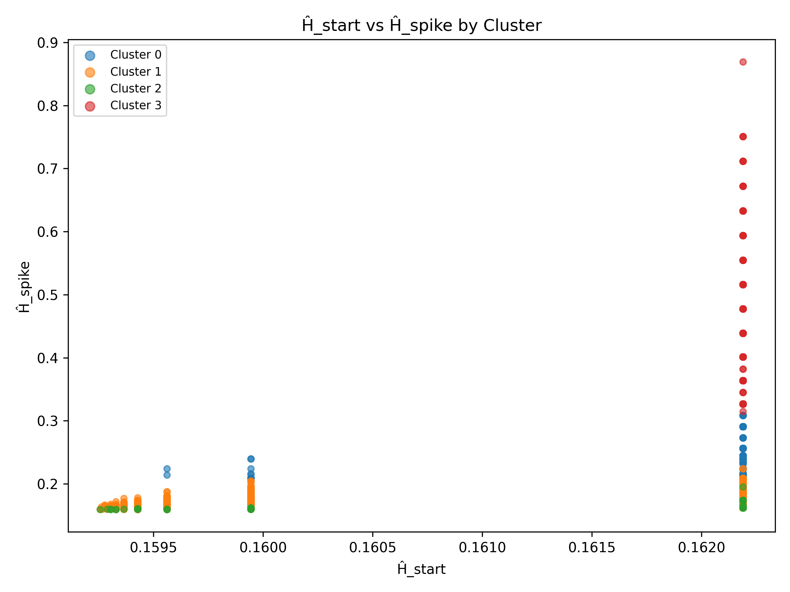

# Entropic Collatz Conjector

[](LICENSE)

A collection of scripts for exploring the classic Collatz Conjecture through an entropic lens. The project performs large parameter sweeps, derives entropy based metrics and visualizes the results using both static plots and interactive HTML graphics. Below is a taste of one of the generated cluster plots:
For a deeper dive into the theory and usage see the [project wiki](docs/README.md).



## Table of Contents
- [Background](#background)
- [Quick Start](#quick-start)
- [Detailed Documentation](docs/README.md)
- [Running the Main Script](#running-the-main-script)
- [Repository Layout](#repository-layout)
- [Code Overview](#code-overview)
- [Running Tests](#running-tests)
- [Contributing](#contributing)
- [License](#license)

## Background
The Collatz Conjecture is a famous unsolved problem in mathematics. Starting with any positive integer `n`, repeatedly apply the rule:

1. If `n` is even, divide it by 2.
2. If `n` is odd, compute `3n + 1`.

The conjecture states that this process eventually reaches the cycle `4 → 2 → 1` for all starting values. This repository investigates the conjecture using *entropy* inspired quantities. Each orbit is analysed for parity counts (how many times even/odd steps occur), from which several measures are computed:

- **$\hat{H}$ (entropic parity measure)** – captures how the parity distribution evolves.
- **$\pi E$ norm** – a normalization of parity entropy.

These values are used to cluster seeds and to formulate several empirical "laws" about the sequence behaviour.

## Quick Start
1. Clone the repository and create a virtual environment:

```bash
python3 -m venv venv
source venv/bin/activate    # macOS/Linux
venv\Scripts\activate       # Windows
pip install -r requirements.txt
```

2. *(Optional)* If you would like to run the heavier analysis in `test_seed.py`, install TensorFlow separately:

```bash
pip install tensorflow
```

## Running the Main Script
Execute the full sweep and plotting routine with:

```bash
python entropic_collatz_conjector.py
```

The script performs several steps:

1. **Parameter sweep** – iterates over many seeds, computes parity entropy and records the results in `collatz_entropy_results.csv`.
2. **Empirical law classification** – labels each seed with one of six laws based on the measured quantities.
3. **Interactive plots** – generates HTML files (for example `interactive_H_start.html`) that can be opened in a browser for exploration.
4. **Static spirals** – saves images visualising the seed groups along a five‑arm spiral.
5. **Special ratio scan** – searches for seeds whose even/odd counts satisfy a `5:3` ratio.

Output files (CSV, PNG and HTML) will appear in the repository root when the run completes.

## Repository Layout
```
├── entropic_collatz_conjector.py   # main analysis script
├── test_seed.py                    # advanced clustering (requires TensorFlow)
├── src/
│   └── your_module.py              # simple example module used in tests
├── configs/
│   └── default.yaml                # example configuration values
├── tests/
│   └── test_basic.py               # basic unit test
├── requirements.txt
└── README.md
```
Additional PNG and HTML files in the root directory contain saved visualisations from previous runs.

## Code Overview
### entropic_collatz_conjector.py
The script is organised into several sections, each marked in the source file:
1. **Helpers** – functions for generating Collatz sequences and computing the entropy metrics.
2. **Full sweep** – iterates over a range of seeds (controlled by `SWEEP_MAX`) and records features for each seed.
3. **Empirical laws** – classifies seeds into one of six laws and prints summary statistics.
4. **Interactive plots** – uses `plotly` to produce HTML scatter and histogram plots of the computed quantities.
5. **Static spirals** – creates PNG images that arrange seeds along a spiral for visual inspection.
6. **Special parity scan** – searches for seeds with an even:odd ratio of `5:3`.

### test_seed.py
This optional script expands upon the main analysis by clustering seeds using machine learning techniques. It utilises TensorFlow and scikit‑learn to perform feature extraction and unsupervised learning. Because it can be computationally intensive, it is not part of the regular test suite.

### src/your_module.py
A placeholder module containing a single `core_function` used by the example test. It simply returns `42` and can be expanded with your own logic.

## Running Tests
Tests are executed with [pytest](https://pytest.readthedocs.io/):

```bash
pytest -q
```

The default test suite includes a few simple checks in `tests/test_basic.py`. If TensorFlow is not installed, the additional tests in `test_seed.py` are skipped automatically.

## Contributing
Contributions are very welcome! Feel free to open issues or pull requests if you
spot problems or have ideas for new features. If you find this project useful,
consider starring the repository on GitHub to help others discover it.

## License
This project is licensed under the MIT License. See [LICENSE](LICENSE) for details.
